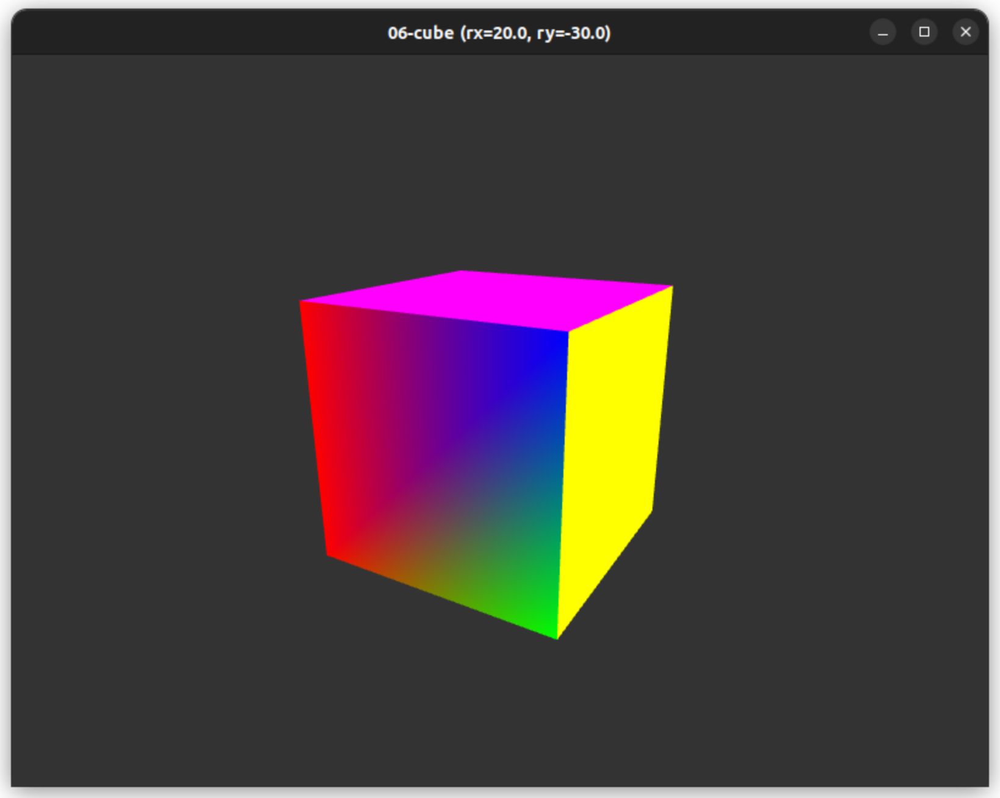
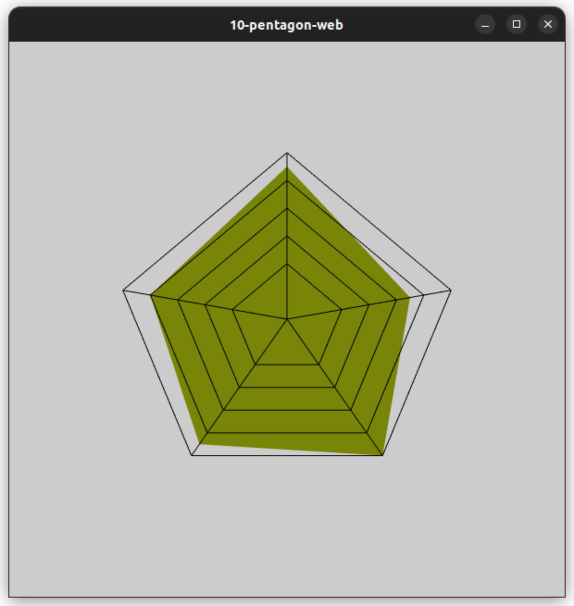
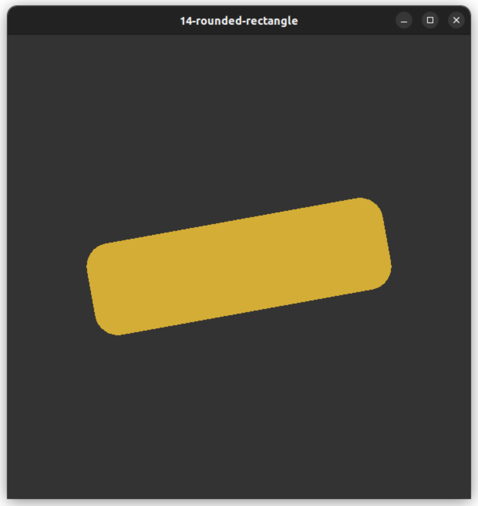

# opengl-playground

## Prerequisites
- These programs were developed and tested on Ubuntu 22.04 LTS.
- Superuser privilege is required to install GCC and libraries.

## Getting started

```
sudo apt-get update
sudo apt-get install build-essential
sudo apt-get install libfmt-dev libglfw3-dev libglm-dev
cd ~
git clone https://github.com/wingkeet/opengl-playground.git
cd opengl-playground
make
bin/01-triangle
```

## Install GLFW dependencies

```
sudo apt-get install cmake pkg-config
sudo apt-get install libxinerama-dev
sudo apt-get install libxcursor-dev
sudo apt-get install libxi-dev
sudo apt-get install doxygen
```

## Compile GLFW from source

Instructions: https://www.glfw.org/docs/latest/compile.html
```
cd ~/opengl-playground
git clone https://github.com/glfw/glfw.git
cd glfw
cmake -S . -B build
cmake --build build
```
This produces a static GLFW library at `glfw/build/src/libglfw3.a`.

## Check hardware acceleration

[Mesa 3D Graphics Library FAQ](https://docs.mesa3d.org/faq.html)
```
$ sudo apt-get install mesa-utils

$ glxinfo | grep "OpenGL vendor"
OpenGL vendor string: Intel

$ glxinfo | grep "OpenGL renderer"
OpenGL renderer string: Mesa Intel(R) Iris(R) Plus Graphics 655 (CFL GT3)

$ glxinfo | grep "direct rendering"
direct rendering: Yes
```

## Gallery






## Resources
- https://github.com/fmtlib/fmt
- https://glad.dav1d.de
- https://www.glfw.org
- https://github.com/g-truc/glm
- https://www.khronos.org/opengl/wiki/Main_Page
- https://registry.khronos.org/OpenGL-Refpages/gl4/
- https://learnopengl.com
- https://github.com/capnramses/antons_opengl_tutorials_book
- https://tutors.com/lesson/how-to-find-orthocenter-of-a-triangle
