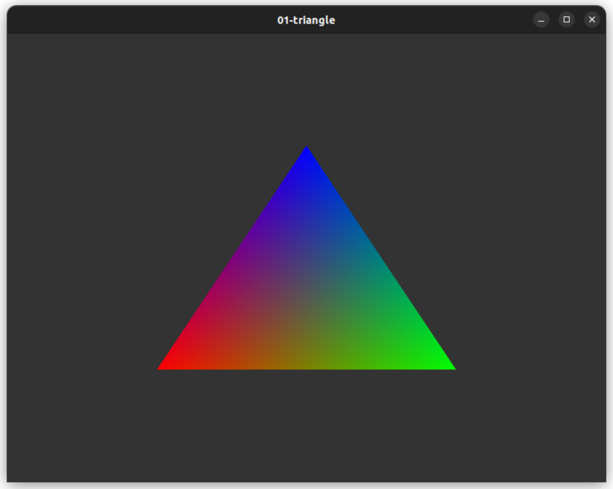

# opengl-playground

## Prerequisites
- These programs were developed and tested on Ubuntu 22.04 LTS.
- Superuser privilege is required to install GCC and libraries.

## Getting started

```
sudo apt-get update
sudo apt-get install build-essential
sudo apt-get install libfmt-dev libglfw3-dev libglm-dev
cd ~
git clone https://github.com/wingkeet/opengl-playground.git
cd opengl-playground
make
bin/01-triangle
```

## Install GLFW dependencies

```
sudo apt-get install cmake pkg-config
sudo apt-get install libxinerama-dev
sudo apt-get install libxcursor-dev
sudo apt-get install libxi-dev
sudo apt-get install doxygen
```

## Compile GLFW from source

Instructions: https://www.glfw.org/docs/latest/compile.html
```
cd ~/opengl-playground
git clone https://github.com/glfw/glfw.git
cd glfw
cmake -S . -B build
cmake --build build
```
This produces a static GLFW library at `glfw/build/src/libglfw3.a`.

## Check hardware acceleration

```
$ sudo apt-get install mesa-utils
$ glxinfo -B
name of display: :0
display: :0  screen: 0
direct rendering: Yes
Extended renderer info (GLX_MESA_query_renderer):
    Vendor: Intel (0x8086)
    Device: Mesa Intel(R) Iris(R) Plus Graphics 655 (CFL GT3) (0x3ea5)
    Version: 23.0.4
    Accelerated: yes
    Video memory: 7799MB
    Unified memory: yes
    Preferred profile: core (0x1)
    Max core profile version: 4.6
    Max compat profile version: 4.6
    Max GLES1 profile version: 1.1
    Max GLES[23] profile version: 3.2
OpenGL vendor string: Intel
OpenGL renderer string: Mesa Intel(R) Iris(R) Plus Graphics 655 (CFL GT3)
OpenGL core profile version string: 4.6 (Core Profile) Mesa 23.0.4-0ubuntu1~22.04.1
OpenGL core profile shading language version string: 4.60
OpenGL core profile context flags: (none)
OpenGL core profile profile mask: core profile

OpenGL version string: 4.6 (Compatibility Profile) Mesa 23.0.4-0ubuntu1~22.04.1
OpenGL shading language version string: 4.60
OpenGL context flags: (none)
OpenGL profile mask: compatibility profile

OpenGL ES profile version string: OpenGL ES 3.2 Mesa 23.0.4-0ubuntu1~22.04.1
OpenGL ES profile shading language version string: OpenGL ES GLSL ES 3.2
```

## Gallery




## Resources
- https://github.com/fmtlib/fmt
- https://glad.dav1d.de
- https://www.glfw.org
- https://github.com/g-truc/glm
- https://www.khronos.org/opengl/wiki/Main_Page
- https://registry.khronos.org/OpenGL-Refpages/gl4/
- https://learnopengl.com
- http://www.opengl-tutorial.org/intermediate-tutorials/tutorial-17-quaternions/
- https://github.com/capnramses/antons_opengl_tutorials_book
- https://tutors.com/lesson/how-to-find-orthocenter-of-a-triangle
- https://en.wikipedia.org/wiki/Equilateral_triangle
- https://en.wikipedia.org/wiki/Regular_polygon
- https://thebookofshaders.com/
